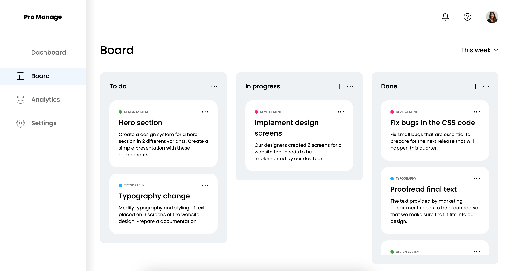
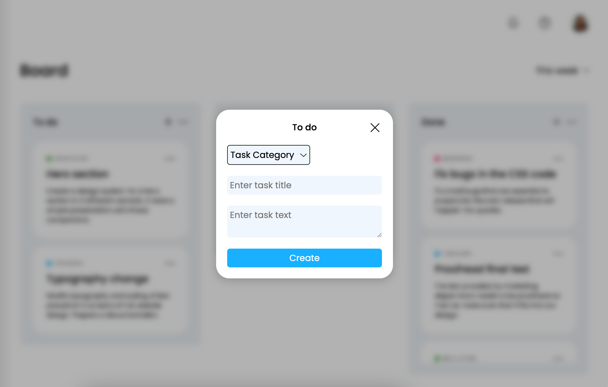
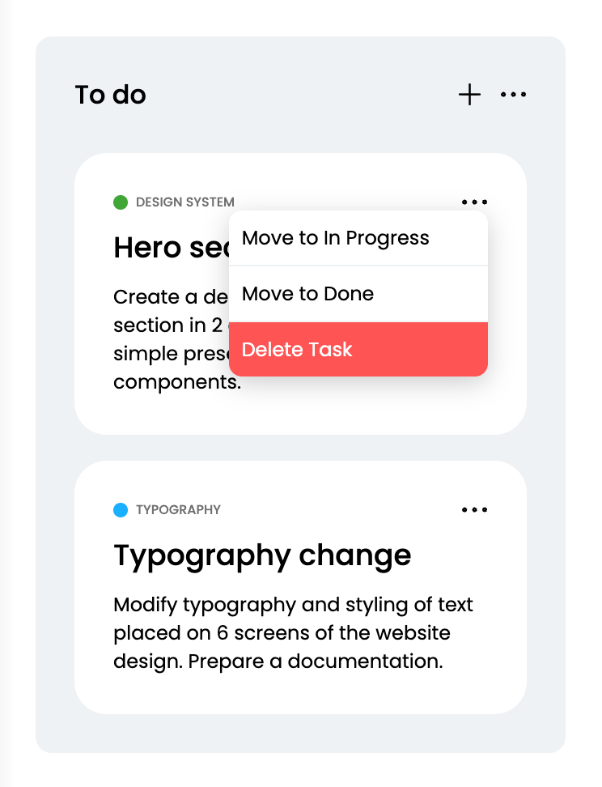

# Pro Manage Dashboard

Небольшое приложение для управления задачами в формате **Kanban-доски**, разработанное с использованием **React**, *
*Redux Toolkit**, **TypeScript** и **Vite**.

Проект создан как учебный pet-project для демонстрации навыков современной frontend-разработки: работы с глобальным
состоянием через Redux Toolkit, модульной архитектуры приложения и стилизации компонентов с помощью SCSS Modules.

---

# Скриншоты

### Главная доска задач


---

### Создание новой задачи



---

### Интерфейс колонок задач



---

# Используемый стек

## Основные технологии

- React
- TypeScript
- Vite

## Управление состоянием

- Redux Toolkit

## Стилизация

- SCSS Modules
- Адаптивная верстка
- Компонентная структура стилей

## Архитектура

Архитектура проекта основана на методологии **Feature-Sliced Design**.

## Инструменты разработки

- ESLint
- Prettier
- EditorConfig

---

# Основные возможности

- создание новых задач через модальное окно
- распределение задач по статусам
- категории задач
- канбан-доска с колонками:
  - **Todo**
  - **In Progress**
  - **Done**
- глобальное состояние через **Redux Toolkit**
- переиспользуемые UI-компоненты
- модульная структура проекта

---

# Структура проекта

```text
src
 ├ app        # конфигурация приложения, store, глобальные стили
 ├ pages      # страницы приложения
 ├ widgets    # крупные UI блоки (доска задач, модальные окна)
 ├ features   # бизнес-логика (работа с задачами)
 └ shared     # переиспользуемые компоненты, хуки, утилиты
```

---

# Установка и запуск

### Клонирование репозитория

```bash
git clone https://github.com/your-username/your-repository.git
```

### Установка зависимостей

```bash
npm install
```

### Запуск проекта в режиме разработки

```bash
npm run dev
```

---

# Что демонстрирует этот проект

- разработку приложений на React
- использование Redux Toolkit для управления состоянием
- написание типизированного кода на TypeScript
- организацию проекта по модульной архитектуре
- создание переиспользуемых UI компонентов
- стилизацию компонентов через SCSS Modules
- работу с современным сборщиком Vite

---

# Возможные улучшения

- Drag & Drop для перемещения задач
- редактирование задач
- сохранение задач в LocalStorage или API
- фильтрация и поиск задач
- добавление тестов
